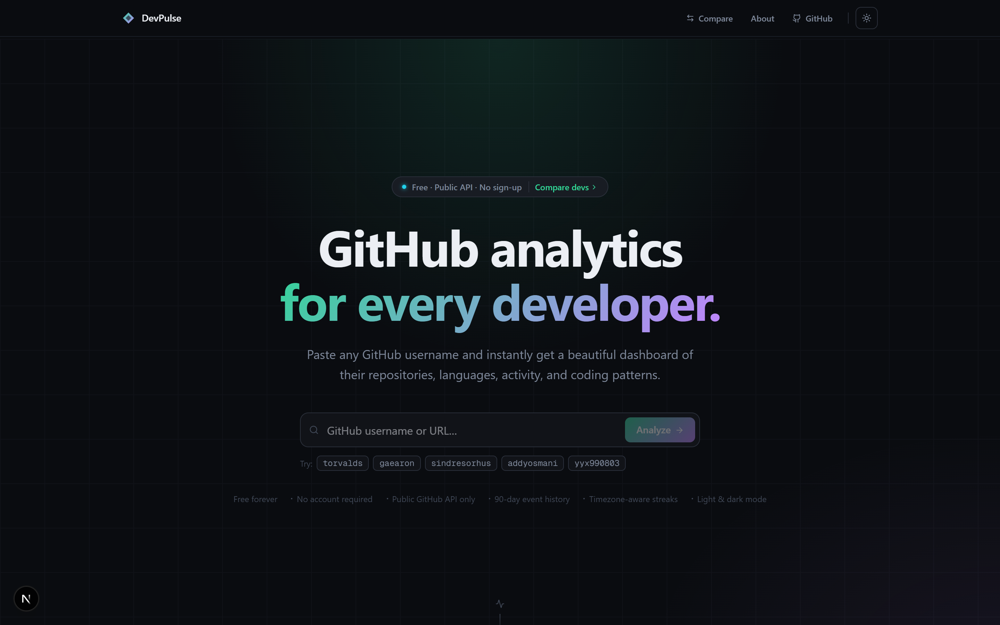
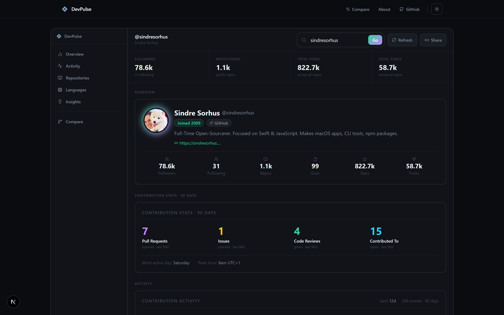
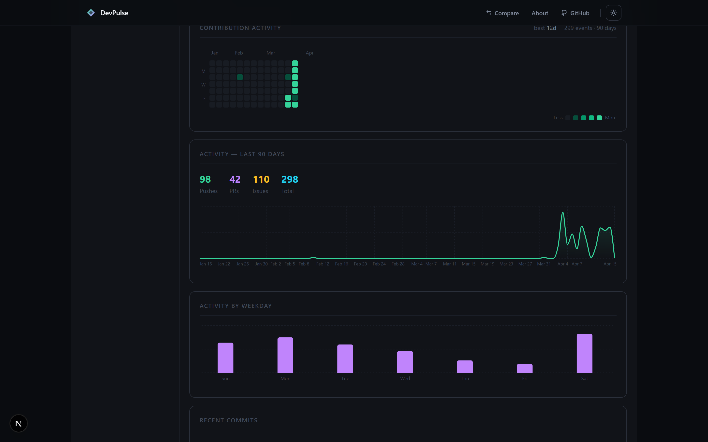
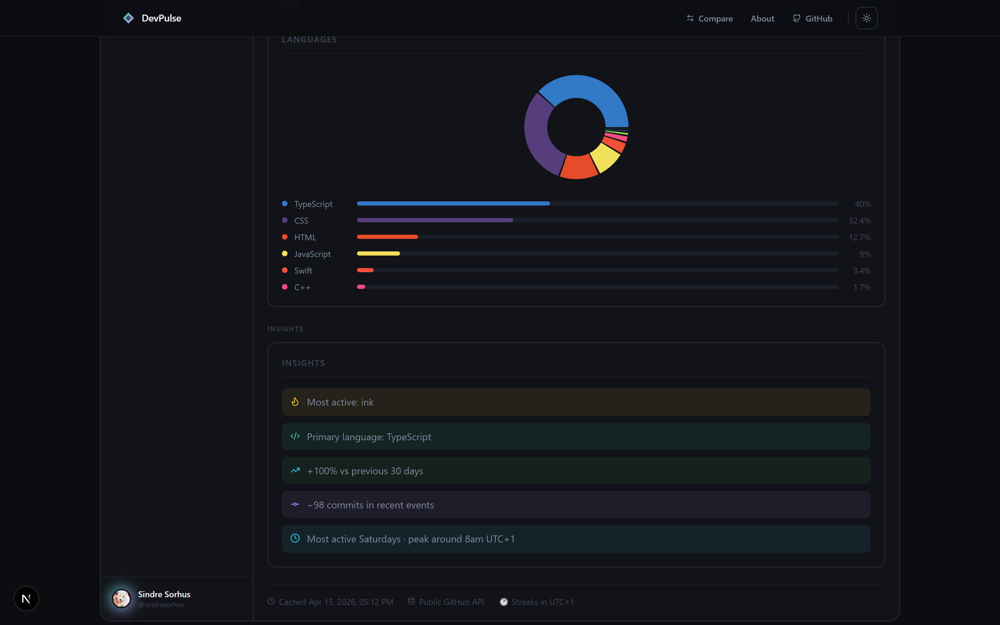
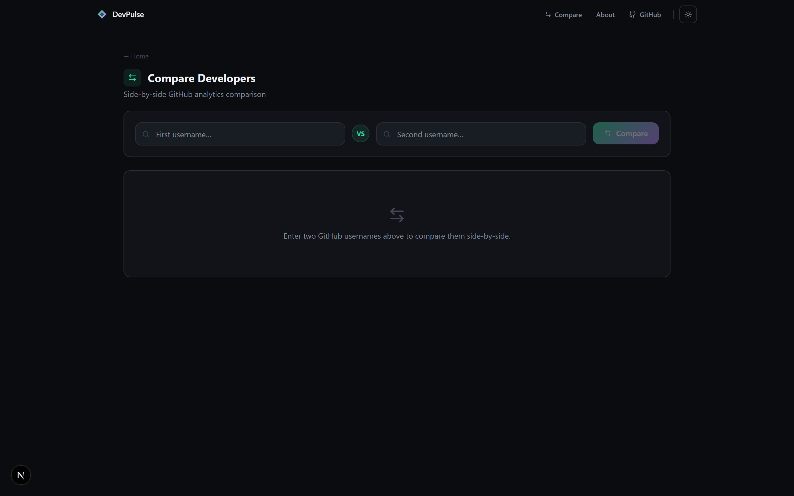

<div align="center">

# DevPulse

**Instant GitHub developer analytics — no sign-up, no OAuth, no nonsense.**

Paste any GitHub username and get a beautiful, shareable analytics dashboard built entirely from public GitHub data.

[](https://nextjs.org)
[](https://www.typescriptlang.org)
[](https://tailwindcss.com)
[](https://vercel.com)
[](./LICENSE)

[**Live Demo →**](https://devpulse-afks.vercel.app) &nbsp;·&nbsp; [**Try it: /u/sindresorhus**](https://devpulse-afks.vercel.app/u/sindresorhus) &nbsp;·&nbsp; [**Compare two devs**](https://devpulse-afks.vercel.app/compare)

<br/>



</div>

---

## Dashboard

Every public GitHub profile gets a full analytics page at `/u/<username>` — no account needed.



The dashboard uses a sidebar layout with five sections: **Overview**, **Activity**, **Repositories**, **Languages**, and **Insights**. Stats are pulled from the public GitHub API and cached for 6 hours so repeat visits are instant.

<br/>

### Activity — 90-Day View



Contribution heatmap, 30-day push event timeline, weekday activity patterns, current & longest streak — all timezone-aware using the viewer's local time.

<br/>

### Languages & Insights



Byte-weighted language breakdown across every public repo rendered as an interactive donut chart and ranked bars. The Insights panel surfaces primary language, most active repo, commit estimate, and activity trend vs the prior 30 days.

---

## Compare



Head-to-head comparison of any two GitHub developers at `/compare`. Stars, followers, commits, streaks, languages, and activity trends — all in one side-by-side view.

---

## Features

| | |
|---|---|
| **Profile overview** | Avatar, bio, location, company, social links, follower & star counts |
| **Contribution heatmap** | 90-day calendar grid with per-day intensity, current & longest streaks |
| **Activity charts** | 30-day area chart + weekday bar chart of push events |
| **Repo explorer** | Most starred and recently updated repos with star/fork counts and language tags |
| **Language breakdown** | Donut chart + ranked percentage bars aggregated across all public repos |
| **AI-style insights** | Primary language, most active repo, activity trend delta, peak coding day |
| **Recent commits** | Latest push events with repo context and timestamps |
| **Developer compare** | Side-by-side `/compare` view for any two GitHub users |
| **Shareable URLs** | Every profile has a permanent `/u/<username>` URL with a copy-link button |
| **Smart caching** | 6-hour TTL with "cached as of" timestamp; MySQL-backed for multi-instance deploys |
| **Light & dark mode** | Theme toggle in header, respects `prefers-color-scheme` |
| **Timezone-aware** | Streaks and heatmaps calculated in the viewer's local timezone |
| **No auth required** | 100% public GitHub API — no sign-up, no OAuth, no keys for visitors |

---

## Stack

| Layer | Tech |
|---|---|
| Framework | Next.js 16 (App Router, Turbopack) |
| Language | TypeScript 5 |
| Styling | Tailwind CSS v4 |
| Components | shadcn/ui (Radix UI primitives) |
| Charts | Recharts |
| Icons | Lucide |
| Cache | In-memory (default) · MySQL / PlanetScale (optional) |
| Hosting | Vercel |

---

## Getting Started

```bash
# 1. Clone
git clone https://github.com/milnee/devpulse.git
cd devpulse

# 2. Install dependencies
npm install

# 3. Set up environment
cp .env.local.example .env.local
# Add GITHUB_TOKEN to raise the rate limit from 60 → 5,000 req/hr (recommended)

# 4. Start dev server
npm run dev
```

Open [http://localhost:3000](http://localhost:3000) and search any GitHub username.

### Environment Variables

| Variable | Required | Description |
|---|---|---|
| `GITHUB_TOKEN` | Recommended | Personal access token (no scopes needed). Raises rate limit to 5,000 req/hr. [Create one →](https://github.com/settings/tokens) |
| `DATABASE_URL` | Optional | MySQL connection string for persistent caching across instances. Falls back to in-memory. |
| `NEXT_PUBLIC_BASE_URL` | Optional | Your deployment URL. Auto-detected on Vercel via `VERCEL_URL`. |

---

## Architecture

```
lib/
  github-client.ts   # GitHub REST API calls
  metrics.ts         # Pure computation — computeDashboard()
  cache.ts           # In-memory + optional MySQL cache (6 hr TTL)
  validate.ts        # Accepts GitHub usernames or profile URLs
  types.ts           # TypeScript interfaces

app/
  page.tsx           # Landing page
  u/[username]/      # Analytics dashboard (server component)
  compare/           # Side-by-side developer comparison
  api/analyze/       # GET /api/analyze?username= — fetch → compute → cache

components/
  dashboard/         # ProfileCard, StatsGrid, ContributionHeatmap,
                     # ActivityCharts, RecentCommits, LanguageChart,
                     # RepoList, InsightsCard, CopyLinkButton
  compare/           # CompareForm
```

**Request flow:**
```
/u/<username>
  → server component calls /api/analyze
  → cache hit  → return JSON immediately
  → cache miss → GitHub API (profile + repos + events + languages)
              → computeDashboard()  → cache → return JSON
  → dashboard renders
```

Each fresh analysis uses ~18 GitHub API requests. Cached profiles cost zero.

---

## Deploy

[](https://vercel.com/new/clone?repository-url=https://github.com/milnee/devpulse)

1. Click **Deploy** above
2. Add `GITHUB_TOKEN` in Vercel → Settings → Environment Variables
3. Done. `VERCEL_URL` is set automatically.

---

## License

MIT
